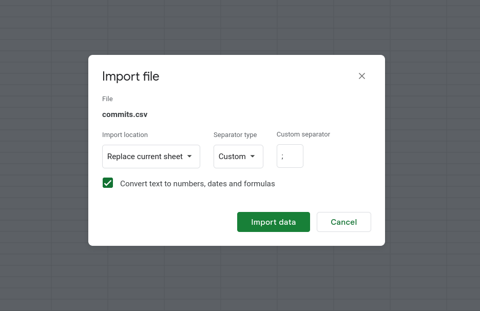

# Vergelijk Excel Sheets

Dit project bevat een script om Excel-bladen te vergelijken. Het script is geschreven in JavaScript en maakt gebruik van Google Apps Script om de gegevens uit verschillende Google Sheets-tabbladen te halen en te vergelijken.

## Stap 1: Genereer de Git-log

Voer het volgende commando uit in de Git-repository om de relevante commits te zien. Pas de zoektermen in de `--grep` flag aan naar jouw behoeften. In dit voorbeeld zoeken we naar commits gerelateerd aan de WBSO-opdracht.

```bash
git log --after="2023-05-01" --grep="order\|consult\|casl\|fhir\|zorgmail\|zorgdomein\|vektis\|dynamic\|ocr\|agb" --pretty=format:"%h;%an;%ad;%s" --date=short --reverse > commits.csv
```

De output wordt opgeslagen in een CSV-bestand genaamd `commits.csv`.

## Stap 2: Importeer de CSV in Google Sheets

Open Google Sheets en importeer het `commits.csv` bestand. Zorg ervoor dat je dit blad de naam "Git log" geeft.

Controleer het blad op fouten. Let vooral op de kolommen vanaf E, hier kunnen problemen ontstaan als de `;` is gebruikt in commit-berichten.



## Stap 3: Verkrijg de Clockify-rapporten

Ga naar Clockify en haal de rapporten op voor de gewenste periode. Groepeer deze op: User, Date, Project. Exporteer de resultaten naar een CSV-bestand.


Importeer dit CSV-bestand in een nieuw tabblad in dezelfde Google Sheets waar je de Git-log hebt geïmporteerd. Controleer de gegevens op fouten en verwijder eventueel onnodige kolommen.


## Stap 4: Voer het script uit

Kopieer de code uit het bestand `appscript.js` en voeg deze toe in Google Sheets via Extensions -> Apps Script in de menubalk.

Zorg ervoor dat je drie tabbladen hebt in je Google Sheets: "Summary report", "Git log" en "result". Deze namen moeten overeenkomen met de namen in de code.

Als alles in orde is, klik je op Run. Het script zal in het "result" tabblad een tabel maken met de commits die overeenkomen met de data in Clockify.


